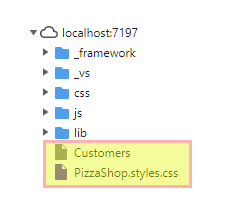
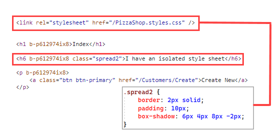

# CSS Isolation In Razor Pages

 The feature will be enabled by default in Razor Pages, so there is no need to add additional packages or configure any services or middleware. All you have to do is to place a style sheet in the Pages folder alongside the page that it is intended to affect. You just need to follow a specific naming convention, which is the Razor page file name with .css on the end.

 The link reference goes in the layout file (page), just like other global style sheet references. I also use the ~/ feature which Razor converts to an absolute path to the web root folder, or wwwroot :

```css
 <link rel="stylesheet" href="~/@(nameof(PizzaShop)).styles.css" />
```



</br>

