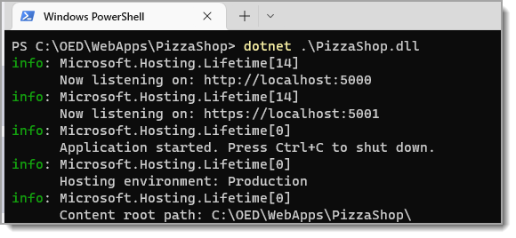
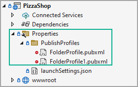
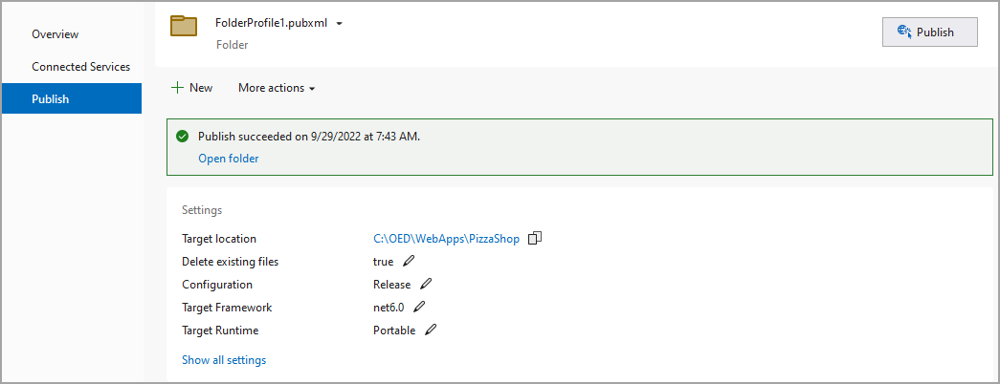

 Main page

- [Planning Step 1](https://learn.microsoft.com/en-us/iis/application-frameworks/scenario-build-an-aspnet-website-on-iis/planning-step-1-plan-iis-web-server-and-asp-net-modules-installation): Plan IIS Web Server and ASP.NET Modules Installation
- [Planning Step 2](https://learn.microsoft.com/en-us/iis/application-frameworks/scenario-build-an-aspnet-website-on-iis/planning-step-2-plan-asp-net-settings): Plan ASP.NET Settings
- [Planning Step 3](https://learn.microsoft.com/en-us/iis/application-frameworks/scenario-build-an-aspnet-website-on-iis/planning-step-3-plan-data-source-settings): Plan Data Source Settings
- [Planning Step 4](https://learn.microsoft.com/en-us/iis/application-frameworks/scenario-build-an-aspnet-website-on-iis/planning-step-4-plan-application-security): Plan Application Security
- [Configure](https://learn.microsoft.com/en-us/iis/application-frameworks/scenario-build-an-aspnet-website-on-iis/configure-an-asp-net-website-on-iis) an ASP.NET Website on IIS
- [Configuring Step 1](https://learn.microsoft.com/en-us/iis/application-frameworks/scenario-build-an-aspnet-website-on-iis/configuring-step-1-install-iis-and-asp-net-modules): Install IIS and ASP.NET Modules
- [Configuring Step 2](https://learn.microsoft.com/en-us/iis/application-frameworks/scenario-build-an-aspnet-website-on-iis/configuring-step-2-configure-asp-net-settings): Configure ASP.NET Settings
- [Configuring Step 3](https://learn.microsoft.com/en-us/iis/application-frameworks/scenario-build-an-aspnet-website-on-iis/configuring-step-3-configure-data-source-settings): Configure Data Source Settings
- [Configuring Step 4](https://learn.microsoft.com/en-us/iis/application-frameworks/scenario-build-an-aspnet-website-on-iis/configuring-step-4-configure-application-security): Configure Application Security

IIS: [Configure Data Source Settings](https://learn.microsoft.com/en-us/iis/application-frameworks/scenario-build-an-aspnet-website-on-iis/configuring-step-3-configure-data-source-settings)

# Run from PowerShell

1. Traverse to publish folder
1. Type in `dotnet .\PizzaShop.dll`
1. Type in `https://localhost:5001` (or which ever address is given)

# Profile location

Note the red icon  :no_entry:, this indicates the profile will not be commited to the GitHub repository.

# Publish sample profile

# Resources

https://jakeydocs.readthedocs.io/en/latest/publishing/iis.html

https://www.learnrazorpages.com/publishing/publish-to-iis

Four Reasons Why Your ASP.NET Core Application is Not Working in IIS

https://www.roundthecode.com/dotnet/asp-net-core-web-hosting/four-reasons-why-your-asp-net-core-application-is-not-working-in-iis

 Main page