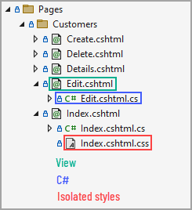
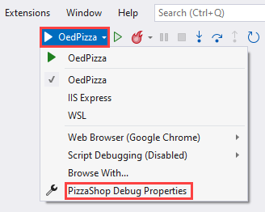
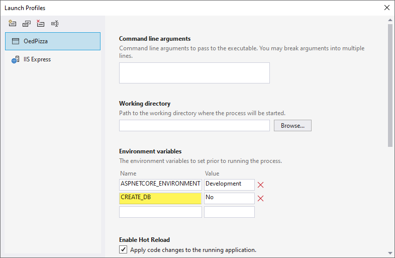
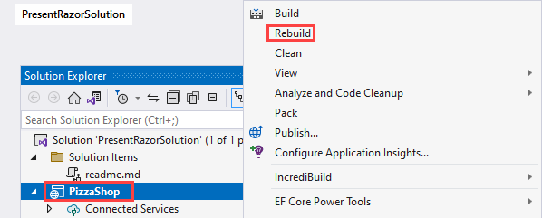
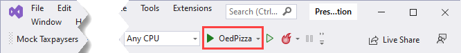
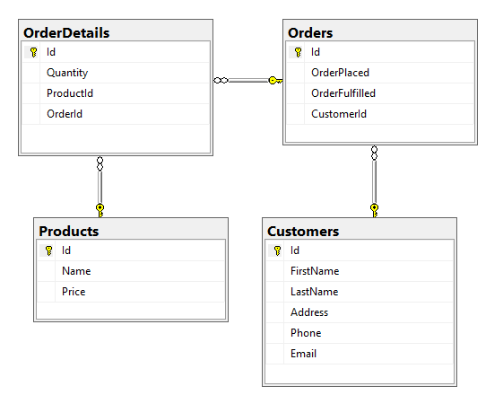

# Sample ASP.NET Core Razor page with EF Core

This repository provides a glimpses into the basics for building an ASP.NET Core Razor page application using Microsoft SQL-Server for a database and Microsoft EF Core 6 (Entity Framework Core).

# Razor Pages

Razor Pages is a newer, simplified web application programming model. It removes much of the ceremony of ASP.NET MVC by adopting a `file-based routing approach`. Each Razor Pages file found under the `Pages` directory equates to an `endpoint`. Razor Pages have an associated C# objected called the page model, which holds each page's behavior. Additionally, each page works on the limited semantics of HTML, only supporting GET and POST methods.

:bulb: A view is a mixture of HTML/CSS and C#

:small_orange_diamond: CSS Isolation scopes [^1] which provides an elegant way to associate a style sheet to one page

```
{Your_namespace}.styles.css
```




## What is the main difference between Razor pages and MVC?

What is the main difference between Razor pages and MVC?
Image result for Razor Pages
Razor Page is similar to the HTML page but it loads data easily. A Razor Page is almost the same as ASP.NET MVC's view component. It has basically the syntax and functionality same as MVC. The basic difference between Razor pages and MVC is that the model and controller code is also added within the Razor Page itself.

# Add a model to a Razor Pages app

The model classes are known as POCO classes (from "Plain-Old CLR Objects") because they don't have a dependency on EF Core. They define the properties of the data that are stored in the database.

:small_orange_diamond: See this tutorial on adding a model [](https://learn.microsoft.com/en-us/aspnet/core/tutorials/razor-pages/model?view=aspnetcore-6.0&tabs=visual-studio)

:small_orange_diamond: See this tutorial on scaffolding pages [](https://learn.microsoft.com/en-us/aspnet/core/tutorials/razor-pages/page?view=aspnetcore-6.0&tabs=visual-studio)

# Setting up the database

:point_right: With this solution open, from Visual Studio menu, select `PizzaShop Debug Properties` (use the small down arrow button)



:point_right: Change **CREATE_DB** from **No** to **Yes**



:point_right: Build the project

:point_right: With Solution Explorer open, right click on the project node and select rebuild.



:point_right: Click on the `green button` to run the project



Web site appear, for now close the browser.

:point_right: Go back to debug properties and revert from Yes to No so that next time the project runs the database is not recreated.


**Notes**

- The database will reside under C:\users\\**your_login** as `OED.Pizza.mdf` and `OED.Pizza_log.ldf`
- To connect to the database via SQL-Server Management Studio (SSMS) use (localdb)\MSSQLLocalDB when prompted for a server


# Database schema



Sample conventional `SELECT`

```sql
DECLARE @OrderId AS INT = 2;
SELECT
        O.Id,
        O.OrderPlaced,
        O.OrderFulfilled,
        O.CustomerId,
        C.FirstName,
        C.LastName,
        OD.Quantity,
        OD.ProductId,
        P.[Name]
FROM
        dbo.Orders AS O
    INNER JOIN
        dbo.Customers AS C
            ON O.Id = C.Id
    INNER JOIN
        dbo.OrderDetails AS OD
            ON O.Id = OD.Id
    INNER JOIN
        dbo.Products  AS P
            ON O.Id = P.Id
WHERE
        (O.Id = @OrderId);
```

How it's done with EF Core

- Include and ThenInclude are representative for JOIN see loading related data [](https://learn.microsoft.com/en-us/ef/core/querying/related-data/eager)

```csharp
public static async Task GetOrder(int orderId)
{
    var result = await _context.Orders
        .Include(o => o.Customer)
        .Include(o => o.OrderDetails)
        .ThenInclude(o => o.Product)
        .FirstOrDefaultAsync(x => x.Id == orderId);
}
```

When running the application, I have setup that EF Core statements are shown in Visual Studio Output window. Example shown below. This can be helpful when there are performance issues to diagnose what needs to be done to improve performance.

:bulb: We can tag EF Core statements with [TagWith](https://learn.microsoft.com/en-us/ef/core/querying/tags) and [TagWithCallSite](https://learn.microsoft.com/en-us/dotnet/api/microsoft.entityframeworkcore.entityframeworkqueryableextensions.tagwithcallsite?view=efcore-6.0).


```sql
SELECT [o].[Id], [o].[CustomerId], [o].[OrderFulfilled], [o].[OrderPlaced], [c].[Id], [c].[Address], [c].[Email], [c].[FirstName], [c].[LastName], [c].[Phone]
FROM [Orders] AS [o]
INNER JOIN [Customers] AS [c] ON [o].[CustomerId] = [c].[Id]
ORDER BY [o].[OrderPlaced]
```

# Publishing

:bulb: See the following [page](publishing.md) for running from publish folder via PowerShell.

Currently have not successfully figured out how to properly publish to `IIS`


[^1]: CSS isolation means creating a CSS file like '.cshtml.css' for each razor page/view(.cshtml). CSS isolation helps to avoid dependencies on global styles that will be very hard to maintain and also avoid style conflicts among the nested content.